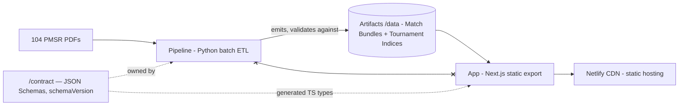
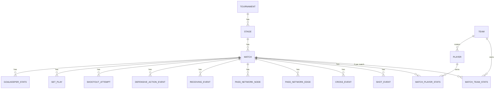

# Architecture Spine — wc-stats

## Design Paradigm

**Contract-first two-system architecture.** Two independently buildable systems, joined by exactly one interface:

- **Pipeline (Epic 1)** — a **pipes-and-filters batch ETL** in Python: discover → extract (per-report, pure) → self-validate → normalize/precompute (global) → emit. Runs only on the dev machine; correctness is designed in (fail loud, binary validation, deterministic output).
- **App (Epic 2)** — a **statically-generated Jamstack SPA**: Next.js static export, every route pre-rendered, all dynamism client-side over static JSON.
- **Contract (`/contract`)** — versioned JSON Schemas describing the artifact set. It is the only thing both systems may know.



Dependency rule: Pipeline and App never import, call, or read each other. App never touches PDFs; Pipeline emits nothing presentational.

## Invariants & Rules

### AD-1 — Hard two-system boundary; the artifact contract is the only interface `[ADOPTED]`

- **Binds:** all
- **Prevents:** the two epics coupling through shared code, shared config, or "just this once" reads across the boundary.
- **Rule:** the only artifact of Epic 1 the App may consume is `/data` + `/contract`. No shared libraries, no cross-imports, no App knowledge of extraction internals, no Pipeline knowledge of rendering, locales, or design tokens.

### AD-2 — Contract mechanics: schema-owned, type-generated, exact-version-matched

- **Binds:** `/contract`, FR-20, both epics
- **Prevents:** two hand-maintained definitions of the same data drifting apart; spurious or missed version-mismatch failures.
- **Rule:** artifact shapes are defined once, as JSON Schema files in `/contract`, written and versioned by the Pipeline epic — authored in the **draft-07-compatible subset of 2020-12** (`$defs` allowed; `prefixItems`, `unevaluatedProperties`, `dependentSchemas` banned) so TypeScript codegen round-trips; the contract epic's first task is a one-schema codegen spike proving fidelity (`json-schema-to-typescript` 15.x; swap to `json-schema-to-ts` or `quicktype` via logged decision if the spike fails). The App consumes **generated** types — never hand-written mirrors. `schemaVersion` is **one global integer declared exactly once** in `/contract/version.json`: the Pipeline stamps it into every artifact at emit; the codegen step also emits it as a generated constant; the App build asserts every artifact it reads carries that exact value and **fails the build** otherwise (FR-20). Any shape change to any schema bumps it. Open vocabularies (leaderboard metric codes, event/set-play types) are **closed schema enums** — adding a value is a shape change that flows into the generated types, so a missing locale label or unit entry is a compile error.

### AD-3 — One identity: entity IDs are the URL slugs `[ADOPTED spine; ASSUMPTION: id scheme]`

- **Binds:** FR-17, FR-25..29, all artifacts, all routes
- **Prevents:** a separate internal-ID and slug system needing a mapping layer; unstable share URLs; IDs flapping across deterministic re-runs.
- **Rule:** the data-model spine is `Tournament → Stage → Match → {Team, Player}` with `MatchTeamStats`, `MatchPlayerStats`, and event tables (`ShotEvent`, `CrossEvent`, `PassNetworkEdge`, `PassNetworkNode` (player ID + x/y in the AD-6 frame — node positions are extracted, never derived from edges), `ReceivingEvent` (type: `offer | movement`), `DefensiveActionEvent`, `ShootoutAttempt`, `SetPlay`, `GoalkeeperStats`) — every Domain D marker family has a contracted destination table. Each entity has exactly one ID, which is also its URL slug: lowercase ASCII kebab (accent-stripped) — match `m73-mexico-argentina`, team `mexico`, player `{surname}-{givenName}-{teamCode}` (name order as listed in the source lineup), e.g. `ramirez-julian-mex`. Stages are enum codes: `group | r32 | r16 | qf | sf | third-place | final`. Player identity is resolved once, in precompute, consuming Extraction Records in **canonical order (ascending match ID)** so resolution is deterministic: normalized (lowercase, accent-stripped) name + team; collisions break by first-seen shirt number. The committed **slug registry** (override map file in `pipeline/`) is the record of ID stability: it is code for AD-8's determinism key, and after first publish a pipeline check fails the run if a previously emitted ID (diffed against committed `/data`) would change without a pinning entry (OQ-4). An ID, once emitted, never changes.

### AD-4 — Artifact set: per-match bundles + tournament indices, client-side everything `[ADOPTED]`

- **Binds:** FR-18, FR-19, FR-25, FR-26, FR-29, FR-34
- **Prevents:** ad-hoc extra artifacts; unbudgeted routes; route/artifact set mismatches; each epic measuring "compressed" differently.
- **Rule:** the Pipeline emits exactly: `data/matches/{match-id}.json` (one Match Bundle per match — all seven domains, a contracted `storyStats` block per team (possession, shots, xG, distance, top speed) for the Hero, a **required** `momentum` key whose value is the series or JSON `null` (never omitted, never `[]`; `null` triggers the App's empty state), and a knockout score shape reserved from v1: `scoreAfter90`, `scoreAfterET`, `shootoutScore`, `winnerTeamId`, `decidedBy: regulation | extra-time | shootout`) and `data/index/` (`tournament.json` — results, standings, nav + search entities; `leaderboards.json`; `team-profiles/{team-id}.json`; `player-profiles/{player-id}.json`). Standings arrays are **ordered with an explicit `rank`** computed by the Pipeline including the full FIFA tiebreaker cascade; the App renders artifact order verbatim. `tournament.json`'s entity lists are the **route manifest**: the App pre-renders exactly and only those entities, and the Pipeline asserts the bijection (one profile artifact per listed entity — empty sections allowed, absence not). Payload budget (PRD §5, JSON payload only; app-shell weight is governed by the Lighthouse ≥90 budget): unit is **gzip -9 over the canonical serialized bytes, measured by the Pipeline** (the App never re-measures), gated per route-payload set — each Match Bundle ≤ 500 KB, each profile artifact ≤ 500 KB, `tournament.json` + `leaderboards.json` **combined** ≤ 500 KB (the Hub loads both). A breach fails the pipeline run and is resolved by splitting artifacts or a logged budget decision, **never by dropping fields** (SM-C2). All filtering/sorting/comparison is client-side over these files. JSON-first: the read-only SQLite artifact is a documented fallback whose trigger is *demonstrated* client-side query failure, never preference.

### AD-5 — Aggregation lives only in Pipeline precompute

- **Binds:** FR-19, FR-26, FR-27, FR-28, App profile/hub/comparison surfaces
- **Prevents:** the same aggregate computed twice (pipeline and browser) drifting apart; client-derived numbers appearing on screen.
- **Rule:** every cross-match number (totals, averages, leaderboards, profile identities, trends, cross-match heatmap zone grids) is precomputed by the Pipeline and read verbatim by the App. The App may filter, select, and perform **user-initiated re-ordering only** — canonical/default order always comes from the artifact. It never sums, averages, or derives cross-match values. Narrow carve-out: within-match derivations from a single bundle that appear on **exactly one surface** and are never Hero-critical (e.g. the match heatmap's zone density) may be computed client-side. Comparison mode renders each side's precomputed values verbatim; the App may derive *presentation geometry only* (shared axis domains, leader-accent determination between two displayed values) and never displays a derived cross-entity number (no deltas, no ratios) unless it ships in an artifact. Reproducibility of aggregates from bundles (FR-19/27/28) is asserted by pipeline tests, not by app runtime code.

### AD-6 — One pitch-coordinate frame, explicit acting team `[ASSUMPTION: frame orientation]`

- **Binds:** Domain D artifacts, every d3 pitch visualization, FR-9, FR-24, SM-3
- **Prevents:** pipeline and app each inventing an origin/direction; events landing on the wrong team's pitch; mirrored maps that pass unit tests and fail spot checks.
- **Rule:** all event coordinates are floats in a 0–100 full-pitch frame, normalized against the **full** pitch rectangle. Every spatial event carries an explicit `teamId` (the acting team), and the frame is oriented **relative to that team's attack direction**: x = 100 at the opponent's goal line, y = 0 on the attacker's left. The App places events by `teamId` and never infers side. Per-family acting-team semantics are pinned in the schema: shot = shooting player's team, with own goals flagged `ownGoal: true` (present in log and scorer list — scorer list attributes to the *benefiting* team — excluded from shot-map rendering); defensive action = defending team; receiving events = receiving player's team; shootout attempts live in `ShootoutAttempt`, never `ShotEvent` (they'd break marker-count Self-Validation). The Pipeline owns normalization. The App renders coordinates as-is: affine viewport transforms (rotate/scale/translate/crop — e.g. the mobile vertical half-pitch) are orientation mapping and allowed; anything that rewrites stored coordinate values is re-normalization and banned. Fidelity gate: rendered maps must spot-check-match the source PDF layout (SM-3).

### AD-7 — Artifacts are raw and locale-neutral

- **Binds:** all artifacts, FR-30..32, Voice & Tone formatting rules
- **Prevents:** display strings or es-CO formatting baked into data; i18n leaking into Epic 1.
- **Rule:** artifacts carry unformatted numerics, ISO 8601 dates (kickoff as venue-local time with UTC offset), and enum codes — never display strings: stage codes (AD-3), shot outcomes `goal | on-target | off-target | blocked | incomplete`, positions `gk | df | mf | fw`, metric codes, distribution/set-play categories likewise. Units are locale-layer metadata keyed by metric code, never artifact strings. Source proper names (teams, players, venues) pass through as-is in English. All human-facing mapping and all number/date formatting happen in the App's locale layer via `Intl`.

### AD-8 — Pipeline correctness paradigm: fail loud, validate per report, deterministic output `[ADOPTED]`

- **Binds:** FR-1, FR-2, FR-10..16, SM-1, SM-C1
- **Prevents:** silently wrong data — the project's one unrecoverable failure mode.
- **Rule:** per-report failures abort that report (with report ID + specifics) and never the batch; the run manifest is the single record of truth (per-report terminal status, self-validation result, warnings). Page discovery is **text-anchored, never index-based**. Assert-on-unknown everywhere: unknown RGB, missing text anchor, unmatched player row → loud failure. Unlinked markers are retained + flagged, never dropped; overlapping markers are **never deduped** — each source drawing is one event (dedup would silently break both positions and the count check). Self-Validation is binary (exact marker count + 100% link rate), never loosened (SM-C1). Template-consistency verification (FR-15) runs **before the full batch is trusted**, on a stratified sample covering at least one report per venue and one per matchday round. Output is deterministic: canonical serialization (sorted keys, per-field fixed precision, UTF-8, LF) makes re-runs byte-identical; idempotence keys on (PDF content hash, code version — which includes the committed slug registry, AD-3).

### AD-9 — Pipeline staging: pure per-report extract, then global precompute

- **Binds:** Epic 1 internal structure, FR-1, FR-17..19, UJ-5
- **Prevents:** aggregation logic creeping into extractors; PDF re-parses to tweak precompute; hidden cross-report state.
- **Rule:** two phases with a persisted intermediate. **Extract** runs per report as a pure function `PDF → Extraction Record` (`work/extracted/{match-id}.json`: raw domains + self-validation result) with zero cross-report knowledge. **Precompute** consumes all Extraction Records (in canonical order, AD-3) and is the only phase that resolves identity, aggregates, and emits `/data`. Marker parsers form a family (shots, crosses, pressure, offers/movement, defensive actions) sharing the one core filter-chain module (pitch-frame detect → shape filter → legend-row exclusion → exact-RGB outcome key). The shape/circle-geometry filter is **mandatory and runs before color keying**: the "incomplete" dark blue is reused by table-header rectangles, so color alone must never admit a marker.

### AD-10 — App state rules: URL + localStorage + ephemeral, nothing else

- **Binds:** Epic 2, FR-29, FR-31, all interactive surfaces
- **Prevents:** each surface picking its own state management; unshareable UI state.
- **Rule:** no global state library, no client cache layer. State lives in exactly three places: the **URL** (route, `/compare` query params, section anchors — the only shareable state), **localStorage** (`wcstats.locale`, `wcstats.theme`, always behind try/catch with in-memory fallback), and **ephemeral component state**. React Context is allowed only for locale and theme. Data access is same-origin `fetch` of static `/data` JSON.

### AD-11 — Rendering split: build-time filesystem read for shell/meta/Hero, client fetch for the rest

- **Binds:** Epic 2 routes, FR-21, FR-33, FR-34, §5 budgets, UJ-1
- **Prevents:** per-page ad-hoc embed-vs-fetch choices that blow the 500 KB/Lighthouse budgets or break the pre-rendered-Hero contract.
- **Rule:** exactly two data paths. At **build time**, routes read artifacts from the filesystem (`generateStaticParams` from the route manifest, AD-4) to generate static params, `<title>`/OG meta, and the pre-rendered Hero-critical content (score, scorers, stage, story stats — from the bundle's `storyStats` block). At **runtime**, the client fetches the same artifacts over HTTP for everything below the Hero (skeletons per UX State Patterns). No third path; no inlining full bundles into HTML. Next config is pinned: `output: 'export'`, `images: { unoptimized: true }` — all imagery is static assets; no runtime image optimization exists under export. All runtime assets are same-origin: fonts (Archivo + Inter per DESIGN.md) self-hosted via `next/font`, zero external requests.

### AD-12 — i18n enforcement: typed dictionaries + lint gate `[ASSUMPTION: mechanism]`

- **Binds:** FR-30..32, every user-facing string including aria/meta strings
- **Prevents:** hardcoded strings surviving review; `en` silently missing keys; the lint gate silently never running.
- **Rule:** UI strings live only in typed locale dictionaries — `locales/es.ts` is canonical, `locales/en.ts` is type-mirrored so a missing key is a compile error — accessed only through the `t()` accessor. ESLint enforces mechanically: `react/jsx-no-literals` with `noStrings` + `noAttributeStrings`/`restrictedAttributes` covering aria/title, plus `no-restricted-syntax` for metadata-object strings; the gate runs in the AD-13 build chain (Next 16's `next build` does not lint). Client bootstrap follows EXPERIENCE.md: pre-rendered Spanish HTML, one inline head script sets **both** `<html lang>`/locale class **and** the theme class (persisted override → `prefers-color-scheme` → dark canonical) before first paint; the string swap runs once, post-hydration. Tactical terms follow the per-term policy table in EXPERIENCE.md verbatim.

### AD-13 — Deployment & gates: committed artifacts, one build chain, Netlify publishes statics only `[ADOPTED]`

- **Binds:** repo layout, CI, FR-33, SM-4
- **Prevents:** CI needing PDFs or Python; deploys breaking on uncommitted data; quality gates existing only as dev-machine discipline; any per-month cost.
- **Rule:** one monorepo (`pipeline/`, `app/`, `contract/`, `data/`). Artifacts in `/data` are **committed**. The App build **copies `/data` into the export output** (owned by Epic 2; Netlify publish dir is `app/out`). Netlify runs only the App build chain — `npm run build` = ESLint (`--max-warnings 0`) → typecheck → schema-version assert (AD-2) → `next build` — on Node 24, and never invokes Python. pytest runs on the dev machine only (solo project; stated, not accidental). The Pipeline runs exclusively on the dev machine. No server functions, no middleware, no runtime env dependencies, and **no analytics or telemetry scripts in MVP** (PRD §6.3) — the $0/no-tracking posture is structural. Security posture: static site, no user input, no secrets, no cookies; supply-chain risk bounded by committed lockfiles. Hosting is portable pure-static: if Netlify's free tier (credit-based for new accounts, ≈15 GB/mo effective) proves tight, the documented fallback is Cloudflare Pages or GitHub Pages — a config move, not an architecture change.

### AD-14 — Contract bootstrap: schema v1 + fixtures before either epic proceeds

- **Binds:** both epics' sequencing, `/contract`, `/data/fixtures`
- **Prevents:** Epic 2 blocking on Epic 1 (or inventing provisional types that become a second schema owner); edge shapes (shootouts, own goals) forcing breaking version bumps mid-build.
- **Rule:** Epic 1's first deliverable — before any extractor beyond the spike — is the complete v1 schema set in `/contract` **plus committed fixture artifacts** in `data/fixtures/` (at least one full Match Bundle and one instance of every index artifact), schema-validated, hand-checked, stamped `schemaVersion: 1`. Fixtures must cover the known edge shapes: a group match, a knockout match decided by extra time + shootout, a match with an own goal, and a match with `momentum: null`. Epic 2 builds and tests against fixtures until real artifacts replace them, and signs off on v1 against a per-surface data-needs checklist (Hero build-time fields, search/typeahead + `<title>`/OG composition fields, comparison fields) before Epic 1 proceeds past extraction of the sample set. Thereafter, contract changes flow one way: **Epic 2 raises a contract-change request, Epic 1 implements it**, the change is a logged decision, and `schemaVersion` bumps with fixtures regenerated in the same commit.

## Consistency Conventions

| Concern | Convention |
| --- | --- |
| JSON keys (contract + artifacts) | `camelCase`. Python uses `snake_case` internally and maps at the emit boundary only. `[ASSUMPTION]` |
| IDs / slugs / filenames in `/data` | lowercase ASCII kebab, accent-stripped; ID = slug (AD-3) |
| Dates & numbers in artifacts | ISO 8601; raw numerics with per-field precision fixed in the schema (determinism, AD-8) |
| Enum values | lowercase kebab strings, closed enums in the schema (AD-2), mapped to copy only in locale files (AD-7) |
| Pipeline errors | typed exception per failure class (missing-anchor, unknown-rgb, link-failure, count-mismatch…); every one lands as a manifest entry, batch continues (AD-8) |
| App error/empty states | exactly the UX State Patterns table; empty state occupies the section's slot, never silent absence (FR-22) |
| Accessibility | WCAG 2.1 AA target (PRD §5); every d3/recharts visualization is paired with a reachable data table rendering the same artifact slice — the text alternative of record (EXPERIENCE Accessibility Floor) |
| Pipeline testing | pytest; the spike reference report (`spike/mex_rsa.pdf`: 16 markers, 2/2/8/3/1) is a permanent ground-truth fixture — any parser change must keep it green. Fixture ground truth is **counts/distribution only**: the spike script's printed coordinates are in a transposed frame vs AD-6 and must not be lifted as expected coordinate values |
| Dependency locking | Python: pinned `pipeline/requirements.txt` via pip (no `uv`); Node: npm with committed `package-lock.json` — locked trees underwrite reproducible builds (AD-8) |
| App components | shadcn/ui primitives + DESIGN.md tokens; behavioral deltas only per EXPERIENCE.md; PascalCase component files |
| Language discipline | code, comments, artifacts, docs in English; user-facing copy only via locales (AD-12) |

## Stack

Verified current 2026-07-21; per-pin source URLs logged in this run's `.memlog.md` and `reviews/review-web-verify.md` alongside this file.

| Name | Version |
| --- | --- |
| Python (pipeline) | 3.13+ |
| pymupdf | 1.28.x |
| pdfplumber | 0.11.x |
| pytest | 8.x |
| Node.js (build only) | 24 LTS |
| Next.js (static export) | 16.2.x |
| React | 19.2 |
| TypeScript | 6.0.x (bridge release; 7.0 Go-native GA'd 2026-07-08, too fresh — keep deprecation warnings clean so the 7.0 move stays cheap) |
| Tailwind CSS | 4.3.x |
| shadcn | CLI (latest) with the Tailwind v4 registry; components vendored into `src/components` |
| d3 | 7.9.x |
| recharts | 3.x latest stable at install |
| json-schema-to-typescript | 15.x (pending the AD-2 codegen spike) |
| Netlify | free tier, static publish |

## Structural Seed

```text
wc-stats/
  contract/            # JSON Schemas + version.json (owned by Epic 1, consumed by Epic 2)
  pipeline/            # Python ETL
    ingest/            #   batch orchestration, run manifest, idempotence
    discover/          #   text-anchored page discovery
    extract/           #   per-domain extractors (tabular A,B,C,E,F,G + spatial D)
    markers/           #   parser family + shared core filter chain + digit-glyph marker→event linking
    validate/          #   self-validation, template-consistency sample mode, budget + route-manifest asserts
    precompute/        #   identity resolution (slug registry), normalization, aggregation, emit
  data/                # committed artifacts (matches/, index/, fixtures/) — the contract's instances
  app/                 # Next.js static export
    src/app/           #   routes: /, /matches/[slug], /players/[slug], /teams/[slug], /compare, /glossary, /about
    src/components/    #   shadcn base + product components (pitch panels, tiles, tables)
    src/viz/           #   d3 pitch visualizations + recharts charts
    src/locales/       #   es.ts (canonical), en.ts (type-mirrored)
    src/lib/           #   generated contract types + SCHEMA_VERSION, fetch helpers, Intl formatting
  spike/               # frozen reference: spike code + mex_rsa.pdf ground truth
```

Deployment & environments: **dev machine** (only place Python runs; produces `/data`, commits it) → **GitHub repo** (single main branch; artifacts + code) → **Netlify free tier** (builds `app/` on push via the AD-13 chain, publishes `app/out` incl. copied `/data` to CDN; static 404; no functions, no env vars). No staging environment — Netlify's default deploy previews suffice. `[ASSUMPTION: GitHub as the remote; any git host works]`



## Capability → Architecture Map

| Capability / Area | Lives in | Governed by |
| --- | --- | --- |
| FR-1..2 ingestion, discovery | `pipeline/ingest`, `pipeline/discover` | AD-8, AD-9 |
| FR-3..8, FR-35 tabular domains | `pipeline/extract` | AD-8, AD-9, AD-7 |
| FR-9..13 spatial extraction | `pipeline/extract` + `pipeline/markers` | AD-6, AD-8, AD-9 |
| FR-14..16 validation & QA | `pipeline/validate` + run manifest | AD-8, AD-4 (budget/manifest asserts) |
| FR-17..20 precompute & artifacts | `pipeline/precompute` → `/data`, `/contract` | AD-2..5, AD-7, AD-14 |
| FR-21..24 Match Dashboard | `app/src/app/matches` + `src/viz` | AD-6, AD-10, AD-11 |
| FR-25..26 Tournament Hub | `app/src/app` (root) | AD-4, AD-5, AD-10 |
| FR-27..28 profiles | `app/src/app/players`, `teams` | AD-5, AD-11 |
| FR-29 comparison | `app/src/app/compare` | AD-10 (URL state), AD-4, AD-5 (presentation-geometry rule) |
| FR-30..32 i18n | `app/src/locales` + lint gate | AD-12, AD-7 |
| FR-33..34 static delivery | `app/` build chain, Netlify | AD-11, AD-13 |
| Epic sequencing / contract evolution | `/contract` + `data/fixtures` | AD-14 |

## Deferred

- **Momentum series shape (OQ-5):** the bundle's `momentum` key is required, `null` or the series object (AD-4); the series' concrete shape lands after the first Domain B/C extraction look, via the AD-14 change flow. Absence = manifest flag + App empty state (FR-35/FR-22).
- **SQLite fallback design:** not designed until the documented trigger fires (demonstrated client-side query failure on real artifacts).
- **Per-field numeric precision table:** fixed at schema-authoring time in `/contract`, not here.
- **Search-index composition:** derived client-side from `tournament.json` entities; field sufficiency is part of Epic 2's AD-14 sign-off checklist.
- **Heatmap zone-grid shape:** match-dashboard heatmap is client-derived from the bundle's Domain D events under AD-5's carve-out; cross-match (profile) heatmaps, if surfaced, are precomputed zone grids in profile artifacts (AD-5). Evaluated during Epic 2's first heatmap story against fixtures; any pipeline-emitted grid arrives via the AD-14 change flow.
- **Netlify account model & caching:** confirm whether the deploy account is legacy (100 GB/mo) or credit-based (~15 GB/mo effective) and record the budget math; header/caching defaults (ETags) fine at launch; fallback hosts documented in AD-13. No in-app telemetry either way.
- **App test harness details** (vitest/Playwright config, Lighthouse CI): tooling choices for the epic to make; the budgets they must assert are fixed in the PRD (§5).
- **Attribution copy & glossary content (OQ-1/OQ-3):** owned by the UX/content pass; the spine only fixes where strings live (AD-12).
- **Post-MVP surface (data pack, tips, similarity search):** gated on OQ-2; nothing in this spine may pre-build for it.
